 

<a href="#what-it-does"><strong>What it does</strong></a> ·
<a href="#why-it-exists"><strong>Why it exists</strong></a> ·
<a href="#how-it-thinks"><strong>How it thinks</strong></a> ·
<a href="#what-makes-it-different"><strong>What makes it different</strong></a> ·
<a href="#built-for-india"><strong>Built for India</strong></a>

 

## What it does

TradeEasy turns a plain-English investing goal into a fully reasoned, continuously monitored portfolio.

You don't fill out a risk questionnaire or pick from a list of mutual funds. You just say what you want:

> *"I have ₹5 lakhs, I want steady growth over the next year, and I'd rather avoid pharma and IT stocks."*

TradeEasy reads that, understands the constraints inside it, and goes to work — pulling live market data, weighing several independent forecasting approaches against each other, checking how the market is currently behaving, and building you a portfolio that's actually built for *that* goal, with the reasoning shown at every step.

 

 

## Why it exists

Professional money managers have always had two advantages over individual investors: better tools, and the discipline to use them. Both are usually locked behind a fund minimum or an advisory fee most people will never pay.

Meanwhile, the average retail investor is left choosing stocks the same way they choose a restaurant — on a feeling. There's no real attempt at diversification math, no ongoing check on whether a strategy is actually working, and no warning system for when the market regime has quietly shifted under them.

TradeEasy exists to close that gap — not by dumbing down the institutional toolkit, but by putting the real one in front of a regular investor and explaining it in language they can act on.

 

## How it thinks

Most "AI stock picker" tools quietly do one of two things: they run a single model and present its output with false confidence, or they average a few models together and call it intelligence. TradeEasy does neither.

**It asks more than one expert, on purpose.**
Every stock gets evaluated by several genuinely different ways of thinking about price movement — one that's good at picking up momentum and pattern, one that's good at finding non-obvious relationships between dozens of signals at once, and one that's built specifically to reason over long stretches of market history instead of just recent noise. They rarely agree completely, and that disagreement is useful information, not a problem to average away.

**It knows what kind of market it's in.**
Before any of those opinions are trusted, TradeEasy first figures out what *regime* the market is currently in — climbing steadily, falling, choppy and directionless, or genuinely volatile and dangerous. A strategy that works beautifully in a calm uptrend can be actively harmful in a panic, so the system changes how much it trusts each signal — and how aggressively it's willing to size positions — depending on which of these states it currently sees.

**It checks its own homework, continuously.**
This is the part almost no retail platform does. TradeEasy doesn't just make a prediction and walk away — it goes back and checks whether its recent predictions actually came true. If its read on the market starts drifting from reality, it doesn't wait for a human to notice. It automatically scales back, and in a serious enough drift, pauses new trades entirely until its judgment is trustworthy again.

**It builds the portfolio like an actual portfolio, not a basket of favorites.**
Once it has a view on each stock, TradeEasy doesn't just buy the top scorers. It solves for the combination of holdings that gives you the best plausible outcome for the level of risk you said you were comfortable with — explicitly accounting for how badly things could go in the worst realistic scenarios, not just on an average day.

**It stress-tests before you ever risk anything.**
Every proposed portfolio is run back through history — does this hold up across real past stretches of market turbulence, not just a friendly backtest window? And you can push it further yourself: ask what happens to your specific holdings if a shock hits a related part of the market, and watch the effect ripple through to your portfolio before it ever happens for real.

 

## What makes it different

**It's the only retail tool that watches itself.**
Every forecasting platform tells you what it thinks. None of them reliably tell you when to stop believing them. TradeEasy's self-monitoring gate is built specifically to catch the moment its own judgment becomes unreliable — and to act on that immediately, not after the damage is visible in your account.

**Disagreement is treated as a feature.**
Instead of forcing every model toward consensus, TradeEasy is built around a panel of genuinely different perspectives whose disagreement sharpens the final call — weighted dynamically by which kind of thinking has actually been right *recently*, in *this* kind of market.

**Every number comes with its reasoning attached.**
A portfolio recommendation with no explanation is a black box you're trusting blindly. TradeEasy shows you, stock by stock, exactly which signals pushed its view up and which pulled it down — so a recommendation can be questioned, not just obeyed.

 

## Built for India

TradeEasy isn't a global platform with NSE bolted on as an afterthought. It's built around how Indian markets actually behave and how Indian retail accounts actually work — the way circuit breakers cut off trading data mid-swing, the realistic settlement timing for trades, standard lot-size rules, and the genuine influence that large institutional flows have on the days that move the most. The benchmark it measures itself against, every time, is the Nifty 50 — because beating a benchmark no one actually invests against isn't a real result.

 

---

TradeEasy is a research and education-oriented project. Nothing it produces is investment advice, and all figures shown in this document are illustrative.

